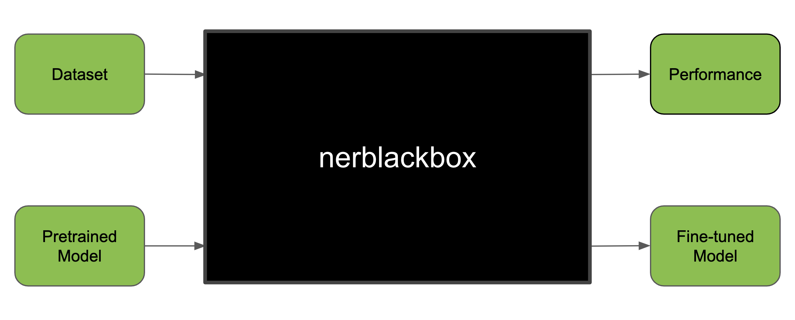

# Overview

**nerblackbox** - a python package to fine-tune transformer-based models for Named Entity Recognition (NER).

-----------
## Resources

* Source Code: [https://github.com/af-ai-center/nerblackbox](https://github.com/af-ai-center/nerblackbox)
* Documentation: [https://af-ai-center.github.io/nerblackbox]([https://af-ai-center.github.io/nerblackbox])
* PyPI: [https://pypi.org/project/nerblackbox](https://pypi.org/project/nerblackbox)

-----------
## About

[Transformer-based models](https://arxiv.org/abs/1706.03762) like [BERT](https://arxiv.org/abs/1810.04805) have had a [game-changing impact](https://paperswithcode.com/task/language-modelling) on Natural Language Processing.

In order to utilize the [publicly accessible pretrained models](https://huggingface.co/transformers/pretrained_models.html) for
[Named Entity Recognition](https://en.wikipedia.org/wiki/Named-entity_recognition),
one needs to retrain (or "fine-tune") them using labeled text.

**nerblackbox makes this easy.**

{: align=left }

`You give it`

- a **Dataset** (labeled text)
- a **Pretrained Model** (transformers)

`and you get`

- the best **Fine-tuned Model**
- its **Performance** on the dataset


-----------
## Usage

- Specify the dataset and pretrained model in an `Experiment Configuration File`

    !!! abstract "my_experiment.ini"
        ``` markdown
        dataset_name = swedish_ner_corpus
        pretrained_model_name = af-ai-center/bert-base-swedish-uncased
        ```


- and use either the [`Command Line Interface (CLI)`](cli) or the [`Python API`](python_api) for fine-tuning and model application:

    !!! note "fine-tuning and model application"
        === "CLI"
            ``` bash
            nerbb run_experiment my_experiment                   # fine-tune
            nerbb get_experiment_results my_experiment           # get results/performance
            nerbb predict my_experiment annotera den här texten  # apply best model for NER
            ```
        === "Python"
            ``` python
            nerbb = NerBlackBox()
            nerbb.run_experiment("my_experiment")                      # fine-tune
            nerbb.get_experiment_results("my_experiment")              # get results/performance
            nerbb.predict("my_experiment", "annotera den här texten")  # apply best model for NER
            ```

See [Getting Started](getting_started) for more details.

-----------
## Features

* GPU support
* Hyperparameter Search
* Early Stopping
